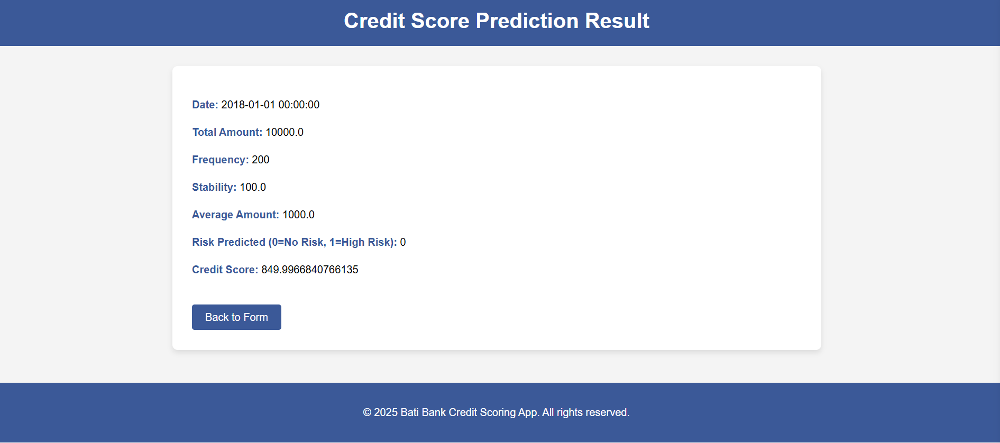

# Credit Scoring Model for Buy-Now-Pay-Later Service at Bati Bank


## Project Overview

This project aims to create a credit scoring model for Bati Bank, a leading financial service provider, in collaboration with a successful eCommerce platform. The goal is to enable a buy-now-pay-later service that allows customers to purchase products on credit if they qualify.

## Business Need

Bati Bank recognizes the growing demand for flexible payment solutions and aims to provide customers with the ability to buy products by credit. This requires developing a robust credit scoring model to assess the creditworthiness of potential borrowers. The model will utilize data from customer transactions to evaluate risk and determine suitable loan conditions.

## Objectives

1. Define a proxy variable to categorize users as high risk (bad) or low risk (good).
2. Select observable features that are strong predictors of the defined default variable.
3. Develop a model that assigns risk probabilities for new customers.
4. Develop a model that assigns credit scores based on risk probability estimates.
5. Predict the optimal amount and duration of loans.

## Data and Features

The data for this project is sourced from the Xente Challenge on Kaggle. The dataset includes the following fields:

- `TransactionId`: Unique transaction identifier.
- `BatchId`: Unique batch number for processing.
- `AccountId`: Unique customer identifier on the platform.
- `SubscriptionId`: Unique identifier for customer subscriptions.
- `CustomerId`: Unique customer identifier.
- `CurrencyCode`: Currency of the transaction.
- `CountryCode`: Geographical code of the customer's country.
- `ProviderId`: Source provider of the purchased item.
- `ProductId`: Name of the purchased item.
- `ProductCategory`: Broader categories for products.
- `ChannelId`: Identifies the transaction channel (e.g., web, Android, iOS).
- `Amount`: Transaction value.
- `Value`: Absolute value of the transaction.
- `TransactionStartTime`: Timestamp of the transaction.
- `PricingStrategy`: Category of pricing structure.
- `FraudResult`: Fraud status (1 for yes, 0 for no).

## Folder Structure

- `data/`: Contains raw and processed data files.
- `notebook/`: Contains the predction, preprocessing and analysis model.
- `scripts/`: Contains main script to run and visulazation.
- `flask/`: Contains flask app for visulization.  

## How to Use

1.Clone the repository:

```bash
git clone "https://github.com/wastb/Credit-Risk-and-Scoring"
```

2.Navigate to the project directory:

```bash
cd Credit-Risk-and-Scoring
```

3.Install dependencies:

```bash
pip install -r requirements.txt
```

4.Start the project:


5.To Forcast store sale use:

```bash
python flask-app/app.py
```

- Open your browser and past `http://127.0.0.1:5000`

- fill the form and submmit to the predict the result.

## Deploy the Web API on Render

Step-by-step instructions to deploy to Render:

1. Sign up for a Render account and connect it to your GitHub repository.

2. Create a new web service by selecting your Credit-Score-Classifications repository.

3. Configure the service settings:
   - select python language
   - Set Start Command to:

    ```bash
     python flask-app/app.py
    ```
4. Deploy the app and get the live URL.

## Results

Below is an example of the credit score and risk modeling predction visualization generated by the project:




## Contact Information

- **Name: Wasihun Tesfaye**
- Email: [wasihunpersonal@gmail.com](mailto:wasihunpersonal@gmail.com)


## License

This project is licensed under the Apache License 2.0. See the [LICENSE](LICENSE) file for more details.
